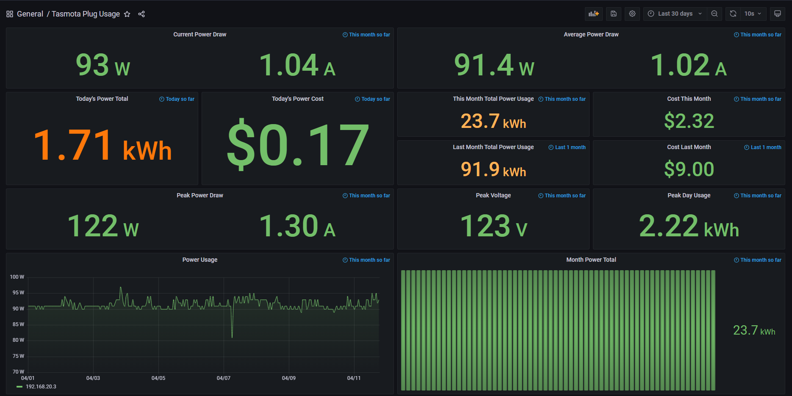

# Refoss-P11 Power Exporter
(this is a fork from: https://github.com/astr0n8t/tasmota-power-exporter)

A custom exporter for Prometheus based on the Tasmota open source smart plug firmware.
Allows you to collect metrics directly from individual smart plugs without the use of HomeAssistant or something similar.
I purchased a pair from Amazon assuming it was the "original" tasmota however, this Refoss-p11 showed up which also has a temperature sensor.
this requires some modifications to the "metrics.py" file to make is work with the original code.

## Grafana Dashboard

Available in [grafana.json](./grafana.json)



## Deployment

The GitHub actions pipeline automatically builds Docker images for ARM and x86 devices for simplified deployment.

Docker-Compose:
```
  tasmota:
    image: edwardtls1/hue_exporter:latest
    container_name: refoss-power
    restart: always
    ports:
    - 8000:8000
    environment:
    - DEVICE_IP=<refoss IP>
    - USER=<user>
    - PASSWORD=<password>
```

Prometheus Config:
```
- job_name: "refoss"

    # metrics_path defaults to '/metrics'
    # scheme defaults to 'http'.

    static_configs:
        - targets: ["127.0.0.1:8000"]
```

## Development

Perform the following:

```
git clone https://github.com/edwardtls/refoss_exporter.git
cd refoss_exporter
docker build -t edwardtls1/hue_exporter:latest -f Dockerfile .
docker push edwardtls1/hue_exporter
```

All of the exporter code is found in [metrics.py](./metrics.py).

## Contributors
- [Nathan Higley](https://github.com/astr0n8t)
- [EdwardTLS](https://github.com/edwardtls)
